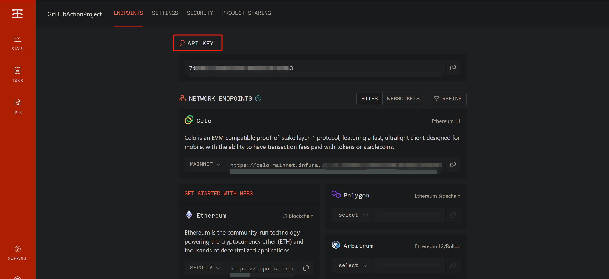

# Tutorial of react-pipeline-box

_The pipeline contains 6 jobs: **build**, **dev**, **dev_validation**, **qa**, **qa_validation**, **prod**. So far, only the jobs of **build**, **dev** and **QA** are implemented. In the QA job, the contracts will be deployed to Sepolia TestNet._

## prerequisite

- [Installation - Truffle Suite](https://trufflesuite.com/docs/truffle/how-to/install/)

- [Git - Downloads (git-scm.com)](https://git-scm.com/downloads)

- [AZURE_CREDENTIALS](https://learn.microsoft.com/en-us/azure/active-directory/develop/howto-create-service-principal-portal)

  The AZURE_CREDENTIALS is a **JSON** object of which the format is as follow:

  ```json
  {
    	"clientId": "xxxxxxxxxxxxxxxxxxxxxxx",
      "clientSecret": "The 'Value' of Client Secrets",
      "subscriptionId":"xxxxxxxxxxxxxxxxxxxxxxx",
      "tenantId":"xxxxxxxxxxxxxxxxxxxxxxx"
  }
  ```

- Create project on [infura](https://app.infura.io/dashboard). Obtain the **API KEY** and **Network Endpoint** from the project.
  

- Requset TestNet Ether, e.g. sepolia Ether, from [faucet](https://faucetlink.to/sepolia) for you account

- Create two **Environments** for your projects in the **setting** page. The **Name**s are **dev_validation** and **qa_validation**. And configure **Required reviewers** in the **Environments / Configure** page.

  _Check [using-environments-for-deployment](https://docs.github.com/en/actions/deployment/targeting-different-environments/using-environments-for-deployment#creating-an-environment) for further help._

  !! Available in public repositories. In private or internal repositories, you must use GitHub Pro, GitHub Team, or GitHub Enterprise.


## steps

1. Create a repository on GitHub

2. Create three **Actions secrets** on the setting page of repository:
   ```json
   {
      "Name": "AZURE_CREDENTIALS",
      "Secret": "the content of AZURE_CREDENTIALS created in prerequisite"
   }
   {
      "Name": "API_KEY",
      "Secret": "API KEY of infura project created in prerequsite"
   }
   {
      "Name": "MNEMONIC",
      "Secret": "MNEMONIC of your account has sepolia ETH"
   }
   ```

3. Clone repository to local

4. Unbox **react-pipeline-box** by running **truffle unbox** in the repository directory

   ```powershell
   truffle unbox lijie-lee/react-pipeline-box
   ```

   _Input **Y** when the message **? Proceed anyway?**  is prompted_

5. Push the _files_ and _directories_ unboxed to remote

   _make sure the branch name is **main**_

_The above 5 steps are all the things needed to be done. Wait for the action to finish executing and then checkout the results._

## Action result

1. **Artifacts** generated by action, including test results and compiled codes

   

2. **Summary** generated by **dev** and **QA** job. The summary contains:

- dev summary
   - SPA Information
      - App URL 
   - Contract Information
      - Ganache IP
      - Ganache FQDN
      - Network ID
   - Contract Address
      - Account Information
      - Address
      - Private Key

   

- qa summary
   - SPA Information
      - App URL
   - Contract Address
      - Network ID
      - Contract Address

   

